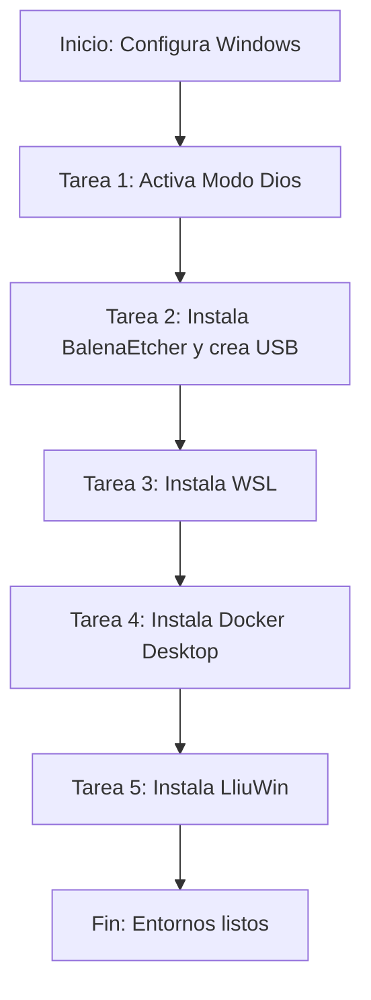

```mermaid
graph TD
    Start[Inicio: Configura Windows] --> T1[Tarea 1: Activa Modo Dios]
    T1 --> T2[Tarea 2: Instala BalenaEtcher y crea USB]
    T2 --> T3[Tarea 3: Instala WSL]
    T3 --> T4[Tarea 4: Instala Docker Desktop]
    T4 --> T5[Tarea 5: Instala LliuWin]
    T5 --> End[Fin: Entornos listos]
```
```
