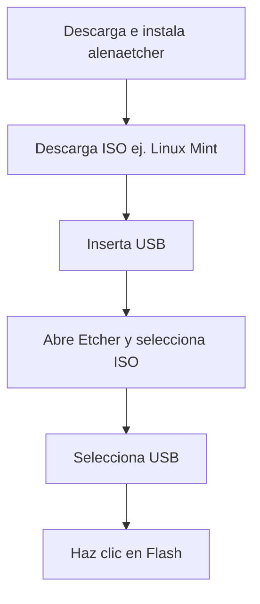

```mermaid
flowchart TD
    A[Descarga e instala alenaetcher] --> B[Descarga ISO ej. Linux Mint]
    B --> C[Inserta USB]
    C --> D[Abre Etcher y selecciona ISO]
    D --> E[Selecciona USB]
    E --> F[Haz clic en Flash]
```
